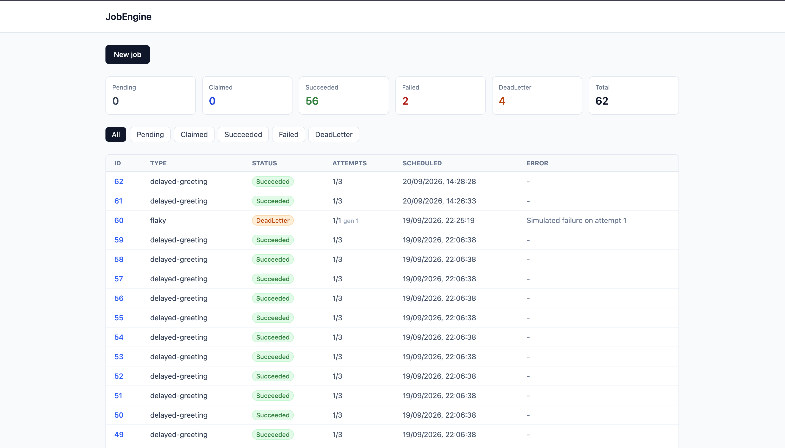
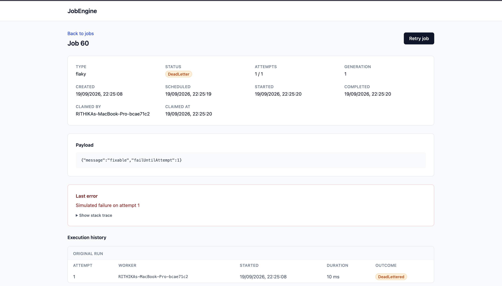
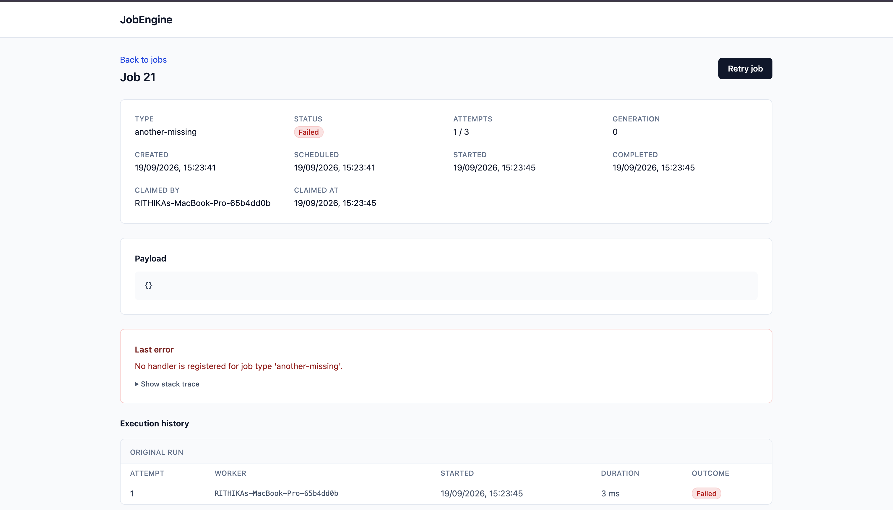

# JobEngine

### Distributed Background Job Processing Engine


JobEngine is a generic background job processing engine built with a database-backed queue and multiple concurrent worker processes.

The system combines a **.NET worker service**, an **ASP.NET Core minimal API**, a **React and TypeScript dashboard**, and a **PostgreSQL database**. Jobs are stored as rows, claimed atomically by workers, dispatched to registered handlers, retried with exponential backoff when they fail transiently, and dead-lettered when they exhaust their attempts.

The engine is generic. It knows nothing about what any individual job does. Adding a new kind of job means writing a handler and registering it, not modifying the engine.

This project was developed as a portfolio-level software engineering project with emphasis on **database concurrency, atomic job claiming, retry and failure design, dependency injection, integration testing against real infrastructure, and REST API development**.

---

## Screenshots

### Job List

Live job queue with status counts, filtering, and pagination. The list polls every two seconds, so jobs appear and change status without reloading.



### Job Detail

Full job metadata, payload, error message with a collapsible stack trace, and execution history grouped by generation.



### Permanent Failure

A job whose handler is not registered fails after a single attempt rather than consuming its full retry allocation.



---

## Execution Guarantee

JobEngine provides **at-least-once execution**, not exactly-once.

A job whose handler succeeds but whose outcome write then fails will be reclaimed and executed again. This is unavoidable. Committing a handler's side effects and committing the engine's record of those side effects are two separate operations, and no amount of care makes them a single atomic step across a process boundary and a database.

Handlers that must not repeat work should be idempotent.

---

## Features

### Atomic Job Claiming

- Single-statement claim using `FOR UPDATE SKIP LOCKED`
- Concurrent workers never receive the same job
- No blocking and no aborted transactions under contention
- Optimistic concurrency token as a secondary defence
- Verified by an integration test that fails when the locking clause is removed

### Handler Registration and Dispatch

- Generic handler contract typed on the payload
- Payload deserialisation handled in one place for all handlers
- Explicit registration, so every supported job type is listed in one readable location
- Handlers resolved per job from the dependency injection container
- Constructor dependencies work normally, including scoped services
- Registration fails at startup on duplicate job types or duplicate payload types

### Retry and Failure Handling

- Exponential backoff with full jitter
- Configurable base delay, maximum delay, and jitter
- Permanent failures skip retries entirely
- Transient failures retried until `MaxAttempts` is exhausted
- Dead-lettering when attempts run out
- Manual retry through the API and dashboard

Job lifecycle:

```text
Pending
├── Claimed
│   ├── Succeeded
│   ├── Failed       (permanent: no handler, or invalid payload)
│   ├── DeadLetter   (transient failures exhausted MaxAttempts)
│   └── Pending      (transient failure, rescheduled with backoff)
```

### Stale Claim Recovery

- Background service scanning for abandoned claims
- Releases jobs held by workers that died without shutting down cleanly
- Uses the same `SKIP LOCKED` primitive, so multiple recovery services do not conflict
- Batched, so a mass failure does not produce one large locking transaction
- Attempt counts deliberately preserved, preventing a crash-looping job from running forever

### Execution History

- One row per execution attempt
- Records worker identity, start time, completion time, and outcome
- Unique constraint that makes duplicate execution impossible to record
- A null outcome identifies an execution that began and never reported an ending

Execution outcomes:

```text
Succeeded
Failed
Retrying
DeadLettered
Released
```

### Visibility Layer

- ASP.NET Core minimal API over job and execution data
- Filtering by status and job type
- Offset pagination
- Aggregate status counts
- Job enqueue with handler validation
- Manual retry of failed and dead-lettered jobs
- React dashboard consuming the API with polling and cache invalidation

---

## System Architecture

JobEngine runs the worker, the recovery service, and the HTTP API in a single host process, with a separate React dashboard.

```text
┌─────────────────────────────┐
│     React Dashboard         │
│                             │
│ Pages • Hooks • API Client  │
└──────────────┬──────────────┘
               │
               │ HTTP / JSON
               ▼
┌─────────────────────────────┐
│   ASP.NET Core Host         │
│                             │
│ Minimal API • DTOs          │
│ Worker Service              │
│ Stale Claim Recovery        │
└──────────────┬──────────────┘
               │
               │ EF Core / Npgsql
               ▼
┌─────────────────────────────┐
│         PostgreSQL          │
│                             │
│  Managed with EF Migrations │
└─────────────────────────────┘
```

The dashboard does not access PostgreSQL directly.

All dashboard data flows through the minimal API.

---

## Technology Stack

### Engine

| Technology | Purpose |
|---|---|
| C# 14 | Core programming language |
| .NET 10 | Application runtime |
| ASP.NET Core | HTTP API and generic host |
| Entity Framework Core 10 | Object-relational mapping |
| Npgsql | PostgreSQL provider for EF Core |
| EFCore.NamingConventions | snake_case identifier mapping |
| Microsoft.Extensions.* | Dependency injection, options, logging |

### Database

| Technology | Purpose |
|---|---|
| PostgreSQL 17 | Relational database |
| EF Core Migrations | Version-controlled schema management |
| Docker Compose | Local database container |

### Frontend

| Technology | Purpose |
|---|---|
| React 19 | User interface library |
| TypeScript 6 | Type-safe frontend development |
| Vite 8 | Build tooling and development server |
| TanStack Query | Data fetching, caching, and polling |
| React Router | Client-side routing |
| Tailwind CSS 4 | Styling |

### Testing and Tooling

| Technology | Purpose |
|---|---|
| xUnit | Automated testing |
| Testcontainers | Real PostgreSQL instances for integration tests |
| WebApplicationFactory | In-memory API integration testing |
| Central Package Management | Solution-wide dependency versioning |
| Git and GitHub | Version control and repository hosting |

---

## Project Architecture

The solution enforces its architecture through one-directional project references.

```text
JobEngine.Core
     ▲
     │
     ├────────────── JobEngine.Persistence
     │                      ▲
     ├─ JobEngine.SampleHandlers
     │                      │
     └────────── JobEngine.Worker
```

### JobEngine.Core

Responsible for:

- Domain model and job status definitions
- Handler contract and execution context
- Handler registry and dispatcher
- Retry policy
- Job store interface
- Failure classification exceptions

`JobEngine.Core` references no infrastructure packages. It cannot see Entity Framework Core, so domain code is physically unable to depend on persistence.

### JobEngine.Persistence

Responsible for:

- `DbContext` and entity configuration
- Database migrations
- PostgreSQL job store implementation
- Raw SQL for atomic claiming and stale claim recovery

### JobEngine.SampleHandlers

Responsible for:

- Example handler implementations
- Demonstrating that handlers live outside the engine

The engine holds no reference to this project. It would compile and run if the project were deleted.

### JobEngine.Worker

Responsible for:

- Dependency injection configuration
- Worker loop and job execution
- Stale claim recovery service
- HTTP API endpoints and response DTOs
- Worker identity and configuration

---

## Job Claiming

The claim operation is a single SQL statement, and therefore a single transaction.

```sql
UPDATE jobs
SET status = 'Claimed',
    claimed_by = $1,
    claimed_at = now(),
    run_at = now(),
    attempts = attempts + 1,
    version = version + 1
WHERE id = (
    SELECT id FROM jobs
    WHERE status = 'Pending' AND scheduled_at <= now()
    ORDER BY scheduled_at
    FOR UPDATE SKIP LOCKED
    LIMIT 1
)
RETURNING *;
```

`FOR UPDATE SKIP LOCKED` instructs PostgreSQL to take a row lock and ignore rows already locked by another transaction rather than waiting for them. Concurrent workers therefore receive different rows.

A read-then-update pair would not be safe. Under PostgreSQL's default `READ COMMITTED` isolation level, two workers can both read the same row before either writes.

This was verified rather than assumed. Removing the locking clause and running the concurrency test produced 27 claims across 20 jobs, meaning seven jobs would have executed twice with no error raised anywhere.

The composite index on `(status, scheduled_at)` exists specifically to serve this query.

---

## Retry Policy

The retry delay is calculated as:

```text
delay = baseDelay * 2^(attempts - 1)
```

The result is capped at `MaxDelaySeconds` and then multiplied by a uniform random factor between zero and one.

This is known as **full jitter**. Without it, a batch of jobs failing simultaneously would retry at the same instant, repeatedly overwhelming whatever service was already struggling. This is the thundering herd problem.

Backoff requires no scheduler. A retryable failure returns the job to `Pending` with `scheduled_at` pushed into the future, and the claim query's existing `scheduled_at <= now()` condition skips it until the delay elapses.

### Failure Classification

| Exception | Classification | Action |
|---|---|---|
| `HandlerNotFoundException` | Permanent | Marked `Failed` immediately |
| `InvalidPayloadException` | Permanent | Marked `Failed` immediately |
| `OperationCanceledException` during shutdown | Not a failure | Claim released, job returned to `Pending` |
| Any other exception | Transient | Retried until attempts are exhausted |

Retrying a job whose handler does not exist only consumes attempts to reach the same conclusion. Permanent failures therefore skip retries entirely.

---

## Attempt Counting

Attempts increment when a job is **claimed**, not when it fails.

The intuitive alternative is to increment on failure. The problem is a job that crashes the worker process outright. No failure handler runs, so no increment occurs, and on restart the same job is claimed again and crashes the worker again. This is called a poison job, and it can take down an entire fleet.

Counting at claim time records every attempt the moment it begins, regardless of how it ends. Stale claim recovery deliberately leaves the count untouched for the same reason.

---

## REST API

The API exposes endpoints for job and execution data.

```text
/api/jobs
/api/jobs/{id}
/api/jobs/{id}/executions
/api/jobs/{id}/retry
/api/stats
/health
```

The API uses standard HTTP methods.

```text
GET     Read jobs, executions, and statistics
POST    Enqueue a job, retry a failed job
```

Entities are never returned directly. Separate response DTOs control what is exposed, so the concurrency token remains internal and the list endpoint omits full stack traces that only the detail endpoint needs.

### Query Parameters

| Parameter | Endpoint | Purpose |
|---|---|---|
| `status` | `/api/jobs` | Filter by job status |
| `type` | `/api/jobs` | Filter by job type |
| `page` | `/api/jobs` | Page number, defaults to 1 |
| `pageSize` | `/api/jobs` | Items per page, maximum 100 |

---

## Validation

Validation occurs at the API layer, the application layer, and the database layer.

Validation includes:

- Job type must have a registered handler
- Payload must be syntactically valid JSON
- `MaxAttempts` must be at least one
- Status filter values must exist in the status enum
- Page numbers and page sizes must fall within bounds
- Scheduled times are converted to UTC before storage
- Configuration values are validated at host startup

Startup validation uses `ValidateOnStart`, so a misconfigured application fails immediately with a descriptive message rather than starting successfully and behaving strangely later.

### Database Constraints

- Check constraint restricting `status` to valid values
- Unique constraint on `(job_id, generation, attempt)` in the execution log
- Foreign key from executions to jobs with cascade delete
- Not-null constraints on every field that must always be present
- Default value for `max_attempts`

---

## Error Handling

The API returns structured error responses. The dashboard parses these and displays the server's message rather than a generic status code.

| Status | Meaning |
|---|---|
| `400 Bad Request` | Invalid input, unknown job type, or malformed payload |
| `404 Not Found` | Requested job does not exist |
| `409 Conflict` | Operation conflicts with the job's current state |
| `503 Service Unavailable` | Database unreachable, reported by `/health` |

Error responses for unknown values include the valid alternatives. An unknown status filter returns the list of valid statuses, and an unknown job type returns the list of registered handler types.

### Error Columns

`last_error_message` and `last_error_detail` are deliberately unconstrained `text` columns, with truncation applied in application code instead.

A length constraint would be the consistent choice, but these columns are written inside the error handler. If a message exceeded the limit, the insert would fail while recording a failure, and the job would be left with no record of what went wrong.

An error path must not be able to fail on its own constraints.

---

## Database Design

JobEngine uses two tables.

```text
jobs
job_executions
```

### jobs

| Column | Type | Nullable | Purpose |
|---|---|---|---|
| `id` | `bigint` | No | Primary key, identity |
| `type` | `varchar(100)` | No | Handler key |
| `payload_json` | `text` | No | Serialised job input |
| `status` | `varchar(20)` | No | Current status, check constrained |
| `attempts` | `integer` | No | Attempts used in this generation |
| `max_attempts` | `integer` | No | Attempt allowance, default 3 |
| `generation` | `integer` | No | Incremented by manual retry |
| `created_at` | `timestamptz` | No | Creation time |
| `scheduled_at` | `timestamptz` | No | Earliest eligible run time |
| `run_at` | `timestamptz` | Yes | When execution began |
| `claimed_by` | `varchar(100)` | Yes | Worker holding the job |
| `claimed_at` | `timestamptz` | Yes | When the claim was taken |
| `completed_at` | `timestamptz` | Yes | When the job reached a terminal state |
| `last_error_message` | `text` | Yes | Exception message |
| `last_error_detail` | `text` | Yes | Full exception detail |
| `version` | `integer` | No | Optimistic concurrency token |

### job_executions

| Column | Type | Nullable | Purpose |
|---|---|---|---|
| `id` | `bigint` | No | Primary key, identity |
| `job_id` | `bigint` | No | Foreign key to `jobs` |
| `generation` | `integer` | No | Generation this execution belonged to |
| `attempt` | `integer` | No | Attempt number within the generation |
| `worker_id` | `varchar(100)` | No | Worker that ran the execution |
| `started_at` | `timestamptz` | No | Execution start time |
| `completed_at` | `timestamptz` | Yes | Execution end time |
| `outcome` | `varchar(20)` | Yes | Result, null if never completed |

### Indexes

```text
ix_jobs_status_scheduled_at              on jobs (status, scheduled_at)
ux_job_executions_job_id_generation_attempt  on job_executions (job_id, generation, attempt) UNIQUE
```

The unique index does more than detect duplicate execution. The worker inserts the execution row **before** dispatching, so a second worker holding the same job and attempt fails the insert and the handler never runs.

Attempt numbers repeat across generations because manual retry resets the attempt counter. The generation column is what keeps each run distinguishable while preserving the full history.

### Timestamps

All timestamps are stored in UTC. Npgsql enforces this at the driver level: a `DateTime` whose `Kind` is not `Utc` throws rather than being silently converted.

For a scheduler this is a feature. A daylight saving transition can otherwise cause a job to run twice or not at all.

---

## Database Migrations

Schema management uses **Entity Framework Core Migrations**.

Migrations are located at:

```text
src/JobEngine.Persistence/Migrations/
├── 20260913172501_InitialCreate.cs
├── 20260917113326_SplitErrorColumns.cs
├── 20260918075146_AddJobExecutions.cs
└── 20260919102618_AddJobGeneration.cs
```

Applied migrations are tracked in the `__EFMigrationsHistory` table, so migrations apply only once and can be run repeatedly without effect.

Generated migrations should always be reviewed before they are applied. Entity Framework Core infers schema changes by comparing the current model against a stored snapshot, and inference is a guess. It has heuristics for detecting renames, and correctly produced a `RenameColumn` when `last_error` became `last_error_message`. It does not always get this right.

---

## Configuration

Runtime configuration is bound from `appsettings.json` using the .NET options pattern.

```json
{
  "Worker": {
    "PollingIntervalMilliseconds": 1000
  },
  "Retry": {
    "BaseDelaySeconds": 2,
    "MaxDelaySeconds": 300,
    "UseJitter": true
  },
  "Recovery": {
    "StaleClaimThresholdSeconds": 600,
    "ScanIntervalSeconds": 10,
    "BatchSize": 100
  }
}
```

Default values are defined in the options classes rather than only in JSON, so a missing or misspelled configuration section falls back to safe values rather than to nothing.

Both hosted services log their effective configuration at startup. Misplaced configuration is silently ignored by the binder, and the startup log is the only place that shows what is actually in use.

### Stale Claim Threshold

`StaleClaimThresholdSeconds` must exceed the runtime of the longest handler.

A threshold shorter than a handler's execution time causes recovery to reclaim jobs that are still running, producing exactly the duplicate execution the rest of the design prevents. A fixed threshold cannot distinguish a dead worker from a slow one.

The correct long-term solution is heartbeating, where a worker periodically updates `claimed_at` while a job runs. This is not currently implemented.

---

## Ports

Several services run on non-default ports because the defaults are commonly occupied.

| Service | Port | Reason |
|---|---|---|
| PostgreSQL | `5434` | Avoids conflict with local PostgreSQL installations on 5432 |
| API and worker | `5050` | macOS AirPlay Receiver occupies 5000 and returns empty 403 responses |
| Dashboard | `5173` | Vite default |

The dashboard proxies `/api` and `/health` to the API in development, so the browser sees a single origin and no CORS configuration is required.

---

## Security

The API has **no authentication**. It is intended for local development only.

The API exposes job payloads, exception messages, and full stack traces including absolute file paths. Exposing it on a network would disclose all of that.

An API key or JWT authentication would be required before this API is exposed beyond localhost. This is a deliberate scoping decision for a local tool rather than an oversight.

The development database password is committed in `docker-compose.yml` because the container is local, holds no real data, and is not reachable externally. The application's connection string is stored in .NET User Secrets, outside the repository, so it cannot be committed by accident.

---

## Testing

JobEngine has 73 automated tests across two categories.

### Unit Tests

Fast, in-memory, no external dependencies.

- Retry policy decisions across every attempt count
- Backoff progression and maximum delay enforcement
- Jitter bounds and determinism
- Failure classification per exception type
- Handler registry resolution
- Dispatcher behaviour and error propagation
- Payload deserialisation and validation

### Integration Tests

Run against a real PostgreSQL container started by Testcontainers on a random free port.

- Atomic claiming under concurrency
- Optimistic concurrency conflict detection
- Job outcome recording for every terminal state
- Backoff rescheduling and claim eligibility
- Stale claim recovery, including that recent claims are left alone
- Error message truncation
- API endpoints end to end over HTTP

Testcontainers is used rather than an in-memory provider because the behaviour under test belongs to the database. `FOR UPDATE SKIP LOCKED`, check constraints, and unique indexes do not exist in an in-memory fake.

### Verification Approach

Every safety mechanism in this project was verified by deliberately breaking it and confirming that a test detected the breakage.

- Removing `FOR UPDATE SKIP LOCKED` produced 27 claims across 20 jobs
- Removing the concurrency version increment caused both concurrency tests to fail
- Inverting the stale claim comparison caused four recovery tests to fail
- Removing the status filter from recovery caused it to release terminal jobs
- Removing error truncation caused the truncation test to fail

A test that has never been seen failing is not evidence that the code works.

### Known Limitations

- The execution-level concurrency tests pass even with `SKIP LOCKED` removed. They do not provoke the race hard enough to serve as a negative check. The evidence for safe claiming comes from the claim-level test.
- All automated tests run in a single process. Multi-process concurrency was verified manually: 30 jobs across three worker processes produced 10 executions per worker and zero overlapping executions.

---

## Project Structure

```text
JobEngine/
│
├── docs/
│   └── screenshots/
│
├── src/
│   ├── JobEngine.Core/
│   │   ├── DependencyInjection/
│   │   ├── Handlers/
│   │   ├── Recovery/
│   │   ├── Retry/
│   │   ├── Storage/
│   │   ├── Job.cs
│   │   ├── JobExecution.cs
│   │   ├── JobStatus.cs
│   │   └── ExecutionOutcome.cs
│   │
│   ├── JobEngine.Persistence/
│   │   ├── Configurations/
│   │   ├── Migrations/
│   │   ├── Storage/
│   │   └── JobDbContext.cs
│   │
│   ├── JobEngine.SampleHandlers/
│   │   ├── DelayedGreetingHandler.cs
│   │   └── FlakyHandler.cs
│   │
│   ├── JobEngine.Worker/
│   │   ├── Api/
│   │   ├── Configuration/
│   │   ├── Worker.cs
│   │   ├── StaleClaimRecoveryService.cs
│   │   └── Program.cs
│   │
│   └── JobEngine.Dashboard/
│       ├── src/
│       │   ├── api/
│       │   ├── components/
│       │   ├── pages/
│       │   └── types/
│       ├── package.json
│       └── vite.config.ts
│
├── tests/
│   └── JobEngine.Tests/
│       ├── Api/
│       ├── Handlers/
│       ├── Infrastructure/
│       ├── Persistence/
│       └── Retry/
│
├── .gitignore
├── docker-compose.yml
├── Directory.Packages.props
├── JobEngine.slnx
├── LICENSE
└── README.md
```

---

## Prerequisites

Before running JobEngine locally, install:

- .NET 10 SDK
- Docker
- Node.js 20 or later
- Git

Install the Entity Framework Core command-line tool.

```bash
dotnet tool install --global dotnet-ef
```

Verify the .NET SDK:

```bash
dotnet --version
```

---

## Local Database Setup

Start the PostgreSQL container.

```bash
docker compose up -d
```

Confirm the container is ready.

```bash
docker compose ps
```

Wait for the status to read `(healthy)` rather than `Up`. The health check runs `pg_isready`, so a healthy container is one that is actually accepting connections.

Store the connection string in .NET User Secrets.

```bash
dotnet user-secrets set "ConnectionStrings:JobEngine" \
  "Host=localhost;Port=5434;Database=jobengine;Username=jobengine;Password=localdev" \
  --project src/JobEngine.Worker
```

User Secrets stores this outside the repository entirely, so it cannot be committed by accident. It is not encryption. The file is plain JSON readable by anyone with access to the user account, and it has no place in a deployed environment.

Apply the database migrations.

```bash
dotnet ef database update \
  --project src/JobEngine.Persistence \
  --startup-project src/JobEngine.Worker
```

Two projects are required because the migrations live in `JobEngine.Persistence` while the configuration that builds the `DbContext` lives in `JobEngine.Worker`.

---

## Running the Worker and API

Start the host.

```bash
dotnet run --project src/JobEngine.Worker
```

The API runs at:

```text
http://localhost:5050
```

The same process runs the worker loop and the stale claim recovery service. Both log their effective configuration at startup.

Confirm the API is healthy.

```bash
curl http://localhost:5050/health
```

---

## Running the Dashboard

Open another terminal and navigate to the dashboard.

```bash
cd src/JobEngine.Dashboard
```

Install dependencies.

```bash
npm install
```

Start the development server.

```bash
npm run dev
```

The dashboard runs at:

```text
http://localhost:5173
```

The dashboard proxies API requests to the local API, so the worker should be running before the dashboard is used.

---

## Running Multiple Workers

Each worker process should be given its own name. Environment variables map to configuration keys using a double underscore as the separator.

```bash
Worker__WorkerName=worker-a dotnet run --project src/JobEngine.Worker
```

```bash
Worker__WorkerName=worker-b dotnet run --project src/JobEngine.Worker
```

Only one process can bind the API port, so additional workers will report a port conflict. Set an alternative port or disable the HTTP endpoints for secondary workers.

Without an explicit name, each worker derives an identity from the machine name and a random suffix, so processes remain distinguishable in the execution history.

Every worker process runs its own stale claim recovery service. Concurrent recovery is safe because it uses the same `SKIP LOCKED` primitive.

---

## Running Tests

Docker must be running. The integration tests start their own PostgreSQL container on a random free port, so they do not interfere with the development database.

```bash
dotnet test
```

Expected test result:

```text
Passed!  Failed: 0, Passed: 73, Skipped: 0
```

---

## Writing a Handler

A handler implements `IJobHandler<TPayload>` and receives a deserialised payload and an execution context.

```csharp
public class SendEmailHandler : IJobHandler<SendEmailPayload>
{
    private readonly IEmailClient _client;

    public SendEmailHandler(IEmailClient client) => _client = client;

    public async Task HandleAsync(
        SendEmailPayload payload,
        JobExecutionContext context,
        CancellationToken cancellationToken)
    {
        await _client.SendAsync(payload.To, payload.Subject, cancellationToken);
    }
}
```

Register the handler in `Program.cs`.

```csharp
builder.Services.AddJobHandlers(handlers => handlers
    .AddHandler<SendEmailHandler, SendEmailPayload>("send-email"));
```

`JobExecutionContext` provides `JobId`, `Attempt`, `MaxAttempts`, and a computed `IsFinalAttempt`. Handlers never receive the `Job` entity, so they cannot read or modify engine state.

Each handler requires a distinct payload type. Dispatch resolves handlers by payload type, so two handlers sharing one would shadow each other. Registration throws at startup if this occurs.

Handlers should pass the `CancellationToken` to everything they await. Shutdown is cooperative, and a handler that ignores the token runs to completion regardless while the host waits for it.

### Sample Handlers

| Type | Payload | Behaviour |
|---|---|---|
| `delayed-greeting` | `message`, `delayMilliseconds` | Waits, then logs |
| `flaky` | `message`, `failUntilAttempt` | Throws on any attempt at or below the given number |

---

## Typical Workflow

A typical workflow through JobEngine is:

```text
1. Enqueue a job through the dashboard or API
2. A worker claims it atomically
3. The dispatcher resolves the registered handler
4. The payload is deserialised and passed to the handler
5. The execution is recorded before dispatch
6. The handler runs
7. The outcome is written to both the job and the execution log
8. Transient failures are rescheduled with backoff
9. Exhausted jobs are dead-lettered
10. Dead-lettered jobs can be retried manually
```

---

## Engineering Highlights

JobEngine demonstrates practical experience with:

- C# and the .NET ecosystem
- Database-backed queue design
- Atomic job claiming with `FOR UPDATE SKIP LOCKED`
- Optimistic concurrency control
- Exponential backoff with full jitter
- Poison job protection
- Dead-letter handling
- Stale claim recovery
- At-least-once delivery semantics
- Entity Framework Core and raw SQL interoperation
- EF Core migrations and schema review
- PostgreSQL relational modelling
- Dependency injection and service lifetimes
- The .NET options pattern with startup validation
- Hosted services and the generic host
- Cooperative cancellation
- Structured logging
- Adapter pattern for runtime type dispatch
- ASP.NET Core minimal APIs
- DTO-based API contracts
- Integration testing with Testcontainers
- API testing with WebApplicationFactory
- Negative testing and test verification
- React and TypeScript
- TanStack Query caching and cache invalidation
- Central package management
- Docker Compose
- Git and GitHub

---

## Project Status

The core JobEngine system is complete and operational.

Implemented engineering features include:

- Generic handler registration and dispatch
- Atomic concurrent job claiming
- Multiple worker processes verified against duplicate execution
- Exponential backoff with full jitter
- Permanent and transient failure classification
- Dead-lettering and manual retry
- Stale claim recovery
- Full execution history with worker attribution
- Optimistic concurrency control
- EF Core managed schema across four migrations
- Minimal API with filtering, pagination, and validation
- React dashboard with live polling
- 73 automated tests across unit and integration suites

### Future Work

- Heartbeating to distinguish dead workers from slow handlers
- Continuous integration pipeline
- API authentication
- Cross-process concurrency testing under load
- Job cancellation
- Keyset pagination for large tables

---

## Author

**Rithika Mandiv**  
Software Engineering Undergraduate

- GitHub: [rithikamandiv-ux](https://github.com/rithikamandiv-ux)
- Portfolio: [rithikamandiv.vercel.app](https://rithikamandiv.vercel.app)
- LinkedIn: [rithika-mandiv](https://www.linkedin.com/in/rithika-mandiv/)

---

## License

This project is licensed under the [MIT License](LICENSE).